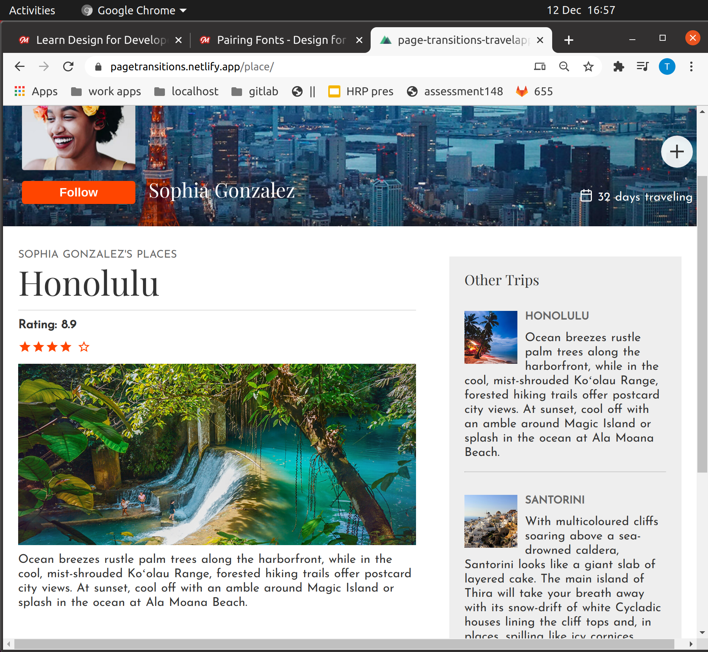
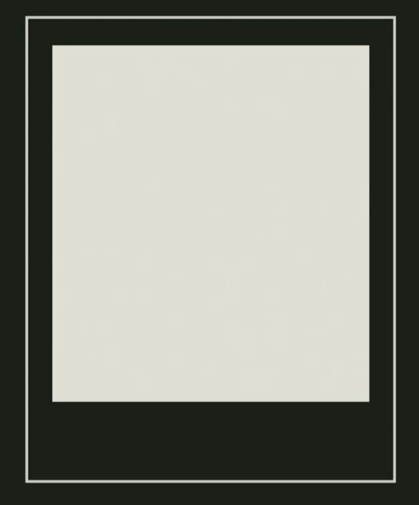
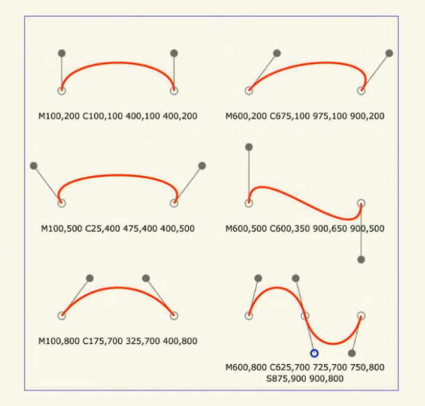
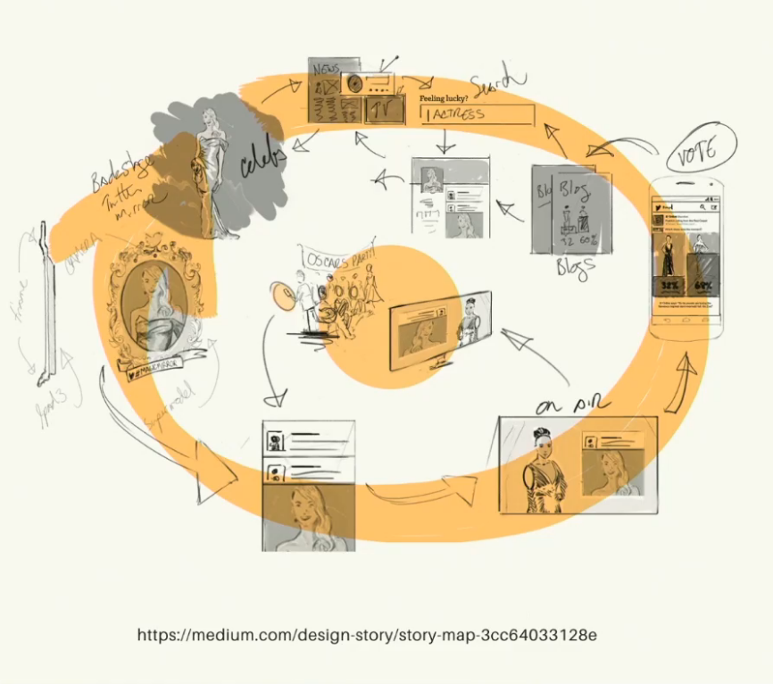
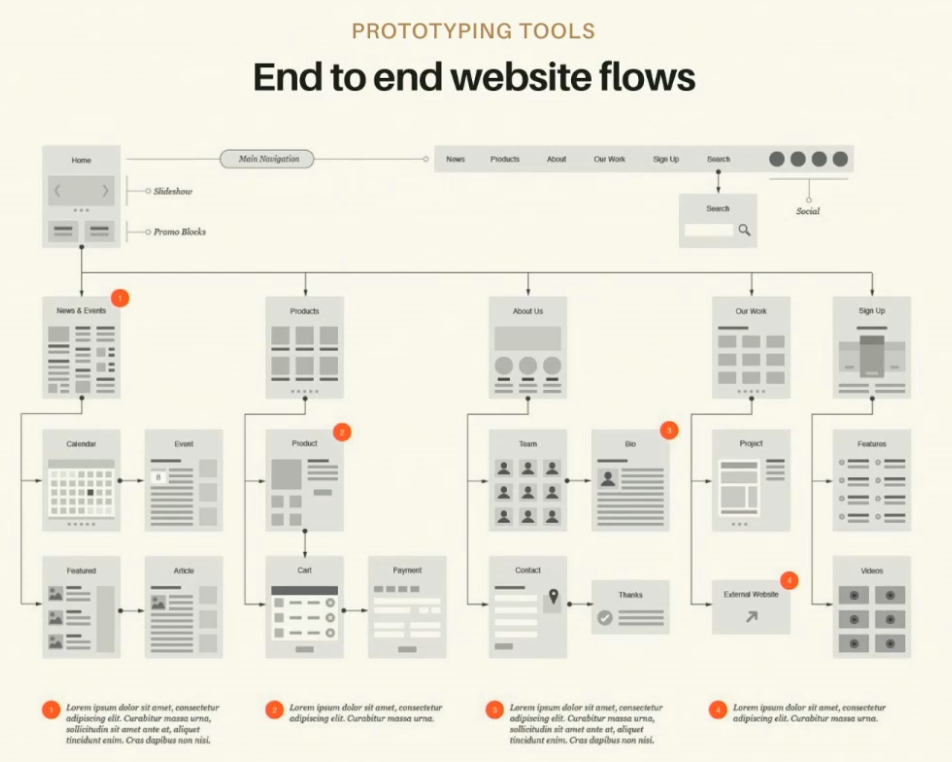
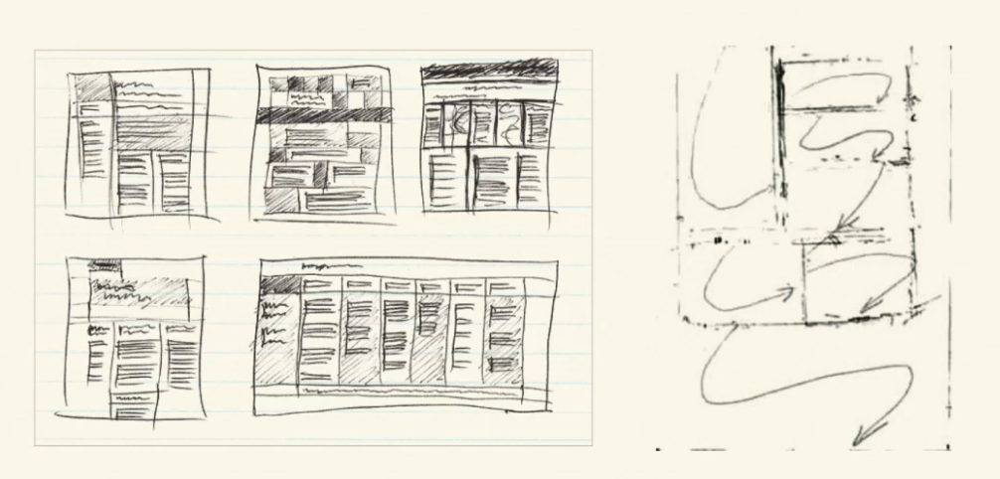
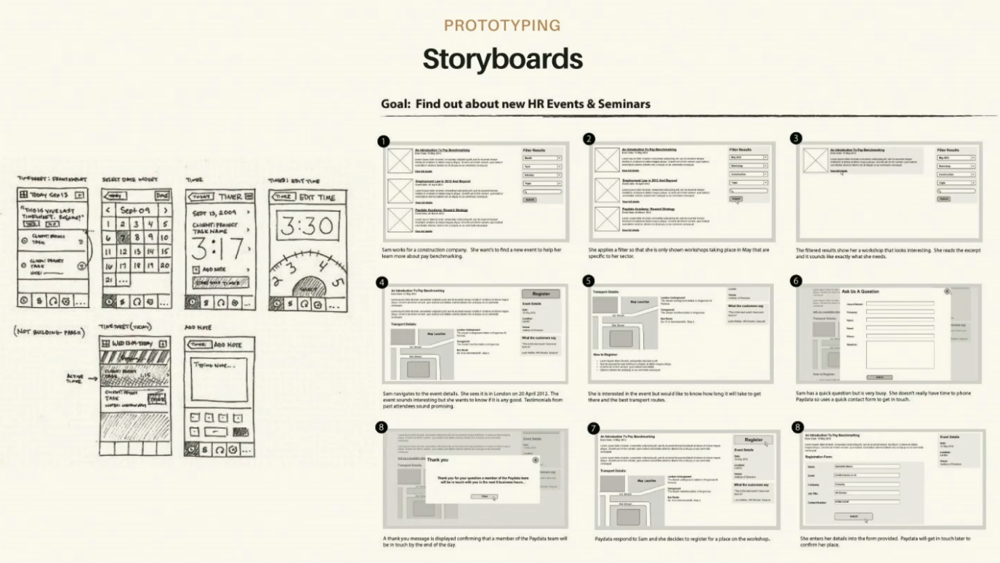
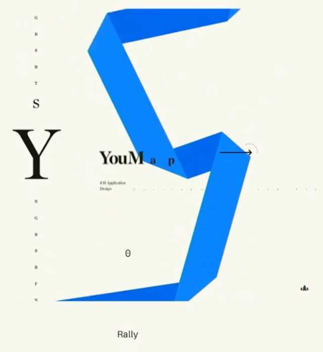
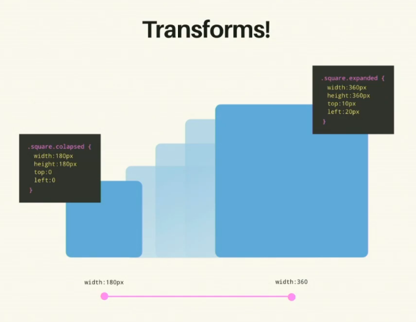

# Design For Developers - Sarah Drasner

My notes from the course.

https://github.com/sdras/design-for-developers

Final codepen: https://codepen.io/sdras/pen/LXgmvq

## Contents

- [Design For Developers - Sarah Drasner](#design-for-developers---sarah-drasner)
  - [Contents](#contents)
  - [Introduction](#introduction)
    - [Right vs. Left Brain](#right-vs-left-brain)
    - [What this Course Is & Setup](#what-this-course-is--setup)
    - [Perfection](#perfection)
    - [Designer vs Developer](#designer-vs-developer)
    - [Introduction to Layout Grids](#introduction-to-layout-grids)
    - [Balance & Symmetry](#balance--symmetry)
    - [Asymmetry](#asymmetry)
    - [Exploring Asymmetry: Learning from Art History](#exploring-asymmetry-learning-from-art-history)
    - [Shape](#shape)
    - [Scale & Cropping](#scale--cropping)
    - [Grid](#grid)
    - [Layout Tools](#layout-tools)
    - [Photoshop Keyboad Shortcuts (skipped)](#photoshop-keyboad-shortcuts-skipped)
    - [Layout and Composition Demo](#layout-and-composition-demo)
    - [Primitive Shapes Exercise](#primitive-shapes-exercise)
    - [Primitive Shapes Review](#primitive-shapes-review)
  - [CSS Layout](#css-layout)
    - [Layout in CSS](#layout-in-css)
    - [CSS Grid Demo](#css-grid-demo)
    - [Grid Naming Example](#grid-naming-example)
    - [CSS Flexbox](#css-flexbox)
    - [Using ClipPath & Other Masking Tools](#using-clippath--other-masking-tools)
    - [CSS Writing Mode](#css-writing-mode)
    - [Grid By Example Demo](#grid-by-example-demo)
  - [Colour Modes](#colour-modes)
    - [Colour Mixing](#colour-mixing)
    - [Colour Modes and Properties](#colour-modes-and-properties)
    - [Colour in Code](#colour-in-code)
    - [Colour Variables](#colour-variables)
    - [Limited Colour](#limited-colour)
    - [Colour Tools](#colour-tools)
    - [Animated Gradient](#animated-gradient)
    - [How to Create a Palette](#how-to-create-a-palette)
    - [Data Visualisation with HSLA Example](#data-visualisation-with-hsla-example)
    - [Creating a Palette Demo](#creating-a-palette-demo)
  - [Typography](#typography)
    - [Typography Basics](#typography-basics)
    - [Typography Resources](#typography-resources)
    - [Pairing Fonts](#pairing-fonts)
    - [Typography For Lawyers](#typography-for-lawyers)
    - [Typographic Colour](#typographic-colour)
    - [Terminology](#terminology)
    - [Typography Demo](#typography-demo)
    - [Exercise and Q&A](#exercise-and-qa)
  - [Inspiration](#inspiration)
    - [Remixing](#remixing)
    - [Sources of Inspiration](#sources-of-inspiration)
    - [UI Kit Demo](#ui-kit-demo)
  - [Image Formats & Resources](#image-formats--resources)
    - [Exporting Tips](#exporting-tips)
    - [SVG](#svg)
    - [SVG Handling and Full Page Background](#svg-handling-and-full-page-background)
    - [Images Demo: Image Overlay Effects](#images-demo-image-overlay-effects)
    - [Layout Demo: Coding Compositions](#layout-demo-coding-compositions)
  - [Prototyping](#prototyping)
    - [Loaders](#loaders)
    - [User Experience & Tools](#user-experience--tools)
    - [Motion Design Language](#motion-design-language)
    - [Types of Prototypes](#types-of-prototypes)
    - [Page Transitions](#page-transitions)
## Introduction

### Right vs. Left Brain

Evidence suggests that *left brain vs right brain* turns out to be a myth. 

https://www.health.harvard.edu/blog/right-brainleft-brain-right-2017082512222

People say stuff like: "I'm a developer, that means I can't do design". 

What the data show is your brain becomes stronger in areas you train it. **So you can learn if you're prepared to go outside of your comfort zone.**

### What this Course Is & Setup

// ??? - "It looks very bootstrapy"

Project setup suggestion:

```
my-project/
├── dev
├── insp
└── src
```

### Perfection

Expectations don't translate to reality right away. 


It's an iterative process.

As with coding, we getting better the more we do it.

### Designer vs Developer

"I'm not a designer. I'm a developer who can do design" - :heavy_check_mark:

"but I do have an degree in Art" ... OK :neutral_face:

### Introduction to Layout Grids

Why Grids? - It's a simple way to place *Order on Chaos*

 ### Balance & Symmetry

Symmetry looks good. We've been using it for thousands of years.


^ Nice thing about symmetry is when we break it, our eye is drawn there immediately.

**Symmetry also gets boring.** - dull, basic

### Asymmetry

The world isn't perfectly symmetrical.

It's more difficult. Requires more though. Still using balance, but more carefully.

Example from Western Art:


And Eastern Art:


And Architecture:


_Wabi Sabi_ - beauty in imperfection


### Exploring Asymmetry: Learning from Art History

Rule of Thirds:


Triad Composition:


^ Keeps eyes from leaving Canvas. Your eyes keep circling.

Swiss Design - large flat geometry shapes


### Shape

Circles draw you eye more than other shapes.

**Saccade** - Eyes keep scanning - Hunter-Gather origins, etc.

**Circles** draw your attention.

They live outside of normal lines though - your eyes compensate:


i.e. `padding: -5px` to make it look natural

**Diagonals are dynamic!** - We mostly use table-based layouts but we also find them in Art!


e.g. used on the web:


### Scale & Cropping


^ examples of how scale and cropping can make an ordinary picture look exciting

### Grid

https://www.amazon.com/Making-Breaking-Second-Updated-Expanded/dp/163159284X

**Anchoring**


### Layout Tools

- Photoshop (Adobe) - old and trusted
- Illustrator (Adobe) - old and trusted
- Sketch - https://www.sketch.com/ - more modern, used a lot now.

Doing it outside of the Browser is recommended! 

### Photoshop Keyboad Shortcuts (skipped)

### Layout and Composition Demo


### Primitive Shapes Exercise 

watched video

### Primitive Shapes Review 

example - design on paper


## CSS Layout

### Layout in CSS

Getting into some code now

Expert on Grids: [YT - Rachel Andrew](https://www.youtube.com/channel/UCJ0_R6U3ZClQDGpVJNjuPAQ), https://rachelandrew.co.uk/

Game to learn Grids - http://cssgridgarden.com/

//todo!

https://rachelandrew.co.uk/archives/2016/03/30/should-i-use-grid-or-flexbox/

### CSS Grid Demo

[Codepen - CSS Grid 1](https://codepen.io/sdras/pen/54dcd199a9f3dbf851b9a8f9c706b8f7)

[Codepen - CSS Grid 2](https://codepen.io/sdras/pen/927251d94ada804fea3af69537dbe212)

### Grid Naming Example

[Codepen - CSS Grid 3](https://codepen.io/sdras/pen/f79830e540a17a3690ab9a9e103b5256)

[Codepen - CSS Grid 4](https://codepen.io/sdras/pen/74d210572cdd934e60982fa742243ebd)

[Codepen - CSS Grid 5](https://codepen.io/sdras/pen/2c40c78b80eda0f03010a6182376f29e) - easy responsive layout

### CSS Flexbox

[A Complete Guide to Flexbox](https://css-tricks.com/snippets/css/a-guide-to-flexbox/)

Website using diagonals - https://webanimationworkshops.com/ - with a nice gradient grey --> white effect from top to bottom of page - nice text wrapping around headshot imgs


### Using ClipPath & Other Masking Tools


^ creating that diagonal

Nice tool: https://bennettfeely.com/clippy/


[Super nice demo - CSS and SVG Masks](https://codepen.io/yoksel/pen/fsdbu)

[React Responsive Layout with SVG and some React-Motion](https://codepen.io/sdras/pen/XdgBOa)

### CSS Writing Mode


https://dribbble.com/shots/3925911-Visual-exploration

### Grid By Example Demo

https://gridbyexample.com/

Found a design which looks similar to one we sketched up earlier: https://codepen.io/rachelandrew/pen/GJVgOV

After tweaking it, we get: https://codepen.io/sdras/pen/LXgmvq

## Colour Modes

Additive and Subtractive Colour Mixing


RGB for screen

CMYK for printing

### Colour Mixing


How good is this colour combo? - https://colorable.jxnblk.com/

**Monochromatic** colours work really well


**Analogous** 


e.g. 


**Split complimentary**


https://color.adobe.com/create/color-wheel

Import to add **accents** (break the pattern?) in your palette to draw attention to certain details

https://www.smashingmagazine.com/2010/02/color-theory-for-designer-part-3-creating-your-own-color-palettes/

### Colour Modes and Properties

Monotone - classic

Duotone - used a lot by Spotify

Shadows - If you shine a yellow light on an object, the shadow is purple. i.e. the shadow is the opposite colour (see colour wheel)


### Colour in Code

**rgba**(0-255, 0-255, 0-255, 0-1)

**hex** - #00000 (black) to #FFFFFF (white) - easy to copy/paste, but not very readable

e.g.`#97 (red) 05 (green) 15 (blue) `

**hsla**(0 - 360, 0 - 100%, 0 - 100%, 0 - 1) 

Hue-saturation-lightness-alpha

e.g. `hsla(150, 50%, 50%, 0.5)`


https://www.smashingmagazine.com/2012/10/the-code-side-of-color/

[Codepen - Playing with Lists and Scroll](https://codepen.io/sdras/details/yyGYeJ)

featuring... for loops in css! :neutral_face: - the result looks great though

### Colour Variables

Save yourself time and pain:


### Limited Colour

Great when you first start out


### Colour Tools

https://dribbble.com/ - steal palettes! 

https://coolors.co/363537-0cce6b-dced31-ef2d56-ed7d3a - great! - generates random palettes

https://paletton.com/#uid=1000u0kllllaFw0g0qFqFg0w0aF - builds palette by proportion of what's on the page

Browser Extension - https://palettab.com/

https://www.adobe.com/products/capture.html - figures out palette from an imported image

https://www.colorzilla.com/gradient-editor/ - old but gold

https://uigradients.com/#ColorsOfSky - find gradients!

### Animated Gradient

[Codepen - Animated transparent mask](https://codepen.io/sdras/pen/akAWPR/) - performant animated gradient

### How to Create a Palette


Gather Accents:


### Data Visualisation with HSLA Example

https://ich.unesco.org/dive/biome/?language=en

### Creating a Palette Demo

https://unsplash.com/ - great place for homepage images

If you start with an image you like, it's easier to create a palette. 

(used tools like Photoshop)

## Typography

### Typography Basics

People ARE INTO Typography - there are conferences on it.

When they messed up the Oscars:


Got handed 'Best Actress' card instead of 'Best Film' card. *before* card shows 'best actress' but it's very small at the bottom. *after* shows a better alternative - they would have seen the wrong card immediately. 

Typography is important for:

- meaning
- hierarchy
- conveying information


### Typography Resources

Where do you get fonts?

https://fonts.google.com/

https://www.fontsquirrel.com/ - free?

https://www.fonts.com/ - not free

https://www.myfonts.com/WhatTheFont/ - works out font from image

https://www.typography.com/ - not free

### Pairing Fonts

Don't use more than three fonts - also gets computationally expensive 

Don't pick fonts that are too similar to each other

https://pagetransitions.netlify.app/place/



Playfair Display + Josefin Sans

use this tool: https://fonts.google.com/specimen/Playfair+Display?selection.family=Roboto#pairings

https://fontjoy.com/ - generates font pairings

### Typography For Lawyers

Keep line length to 45-90 characters

Also good idea to use columns - like newspapers worked out a while ago

### Typographic Colour

https://codepen.io/MadeByMike/

https://css-tricks.com/snippets/svg/text-lock-up/

### Terminology 

Proportional and Monospaced:


Kerning and Leading:


  Widows and Orphans:


Orphans tend to annoy people more than Widows

Ligatures: 


Some people turn these on in code editors too

a thorough [cheat sheet](https://creativemarket.com/blog/typography-terms-cheatsheet?utm_source=Link&utm_medium=CM+Social+Share&utm_campaign=Blog+Post+Social+Share&utm_content=Free+Typography+Basics+Cheatsheet%3A+Anatomy%2C+Classification+%26+Special+Terms+%7E+Creative+Market+Blog&ts=201811)

Text is always centred slightly to the top of the page. Looks strange otherwise: 



Fonts can make a big difference on page loads!

https://github.com/Munter/subfont - Command line tool to optimize your webfont loading. Aggressive subsetting based on your font use, self-hosting of Google fonts and preloading

https://www.robinrendle.com/adventures/ - great newsletter on typography

Loads of ipsum generators out there :laughing:

https://slipsum.com/

https://hipsum.co/ - contains some bad words!

...

### Typography Demo

(working on demo from before - adding fonts)

Some fonts are so popular that they get cached in the browser. Makes surfing the web faster. If you use some obscure font, it might slow things down.

Font Pairing  e.g.

```css
body {
	font-family: 'Raleway', sans-serif;
}

h1, h2, h3 {
    font-family: 'Vidaloka', serif;
}
```

### Exercise and Q&A

Some things look good together and you don't know why - that's fine

You can do a lot with fonts! - https://codepen.io/mandymichael/pen/YYaWop

https://v-fonts.com/ - great if you're indecisive 

## Inspiration

### Remixing

How do get inspired, but not rip off their work?


-- Dan Mall, Designer

https://danmall.me/articles/stealing-your-way-to-original-designs/

**Look around, find your heroes**:

- Dribbble
- Behance
- CodePen
- Glitch
- CodeSandbox

**Get inspired by multiple sources**

**Wait...** - sleep on it

**Work from memory, not directly** 

**Revisit: if it's too close, change it or toss it**

**Look at other disciplines for inspiration outside the web**

- books
- art
- music
- movies, TV, anime
- comic books

**Just like reverse engineering, copying existing work can help you learn** - but you can't claim it as your own

### Sources of Inspiration

https://give-n-go.co/ - A curated gallery of Dribbble shots reworked as interactive CodePen pens.

https://codepen.io/sdras/full/oMZjZa

UI Kits - https://www.shutterstock.com/search/ui+kit for example


https://codepen.io/topics/ui-pattern

e.g. https://codepen.io/aaroniker/pen/OJJBGxW

### UI Kit Demo

(goes through a demo)

https://thenounproject.com/ - Icons and Photos For Everything

## Image Formats & Resources

"You can't be a web performance expert without being an image expert." 


**Free Sources**

https://www.pexels.com/

https://www.freeimages.com/

https://www.freepik.com/

https://images.google.com/

https://unsplash.com/

**Low Cost**

Creative Market

Abode Stock

**Costly**

Shutterstock

IStockPhoto

^ but high quality - worth it if "time is money" or a company is paying you - if you take ages to find a free image then the company has spent the same money in wages.

**Raster & Vector**


https://99designs.co.uk/blog/tips/image-file-types/

we don't transfer `tiff, raw, psd` over the web!

**JPG** - lossy - looks bad when the image gets small

**GIF** - lossy - limits colours - loses colour variety when it gets small - animated gifs used a lot on the web - memes etc, but they can get big!

**PNG** - has transparency

### Exporting Tips 

- double the size, low compression - wut? - https://www.smashingmagazine.com/2015/06/efficient-image-resizing-with-imagemagick/ ?
- https://tinypng.com/
- https://tinyjpg.com/
- Webpack plugins - so you don't have to worry about it 
- https://jakearchibald.github.io/svgomg/

### SVG

SVG is awesome



Easy to work in the DOM

Small (a few KBs) - depends on # path points

Drawing shapes, lines - cheap

Using for textures - expensive

https://css-tricks.com/high-performance-svgs/

Super cool SVG animation - https://codepen.io/sdras/pen/waXKPw

https://codepen.io/shshaw/full/LVKEdv

JPNG.svg - https://codepen.io/shshaw/full/LVKEdv - uses SVG to shrink PNGs

### SVG Handling and Full Page Background

https://css-tricks.com/masking-vs-clipping-use/

Cool codepen - https://codepen.io/noeldelgado/pen/ByxQjL

https://css-tricks.com/perfect-full-page-background-image/

### Images Demo: Image Overlay Effects

(goes through demo on Photoshop)

### Layout Demo: Coding Compositions

(goes through demo)


then got src from svgomg:

```css
<svg xmlns="http://www.w3.org/2000/svg" viewBox="0 0 100 125"><path d="M33.8 89.3c-11.2-2.8-21-21-17.6-33.2-.9-11.9-.7-23.1 3.6-32.5 2-2.6 4.1-5.4 6.5-8.1.2-.2.3-.8.2-.8 14.3-11 32.6-10.2 43.1-3.2 7.5 5 15.4 20 14.9 30.6-.2 4.6-1.3 8.7-3.6 12.8 2 10.3-.6 19.2-6.5 26.3-.1.1-.5.3-.7.3 4.9-6.7 7.5-14.4 6.5-23.6-.1-.6-.9 1.2-1-.3 0 .1-.2.2-.3.3-6.6 13.3-29.4 19.6-40.6 11.9-6.2-1.4-11.5-4.5-15.6-10.5-.3-.4-1-.2-1 .4 1.3 8.2 7.2 13.2 12.1 16.5.8.6-.2.2-.8 0-4.7-2-9.1-6.4-13-11.4.2 10.1 7.3 19.1 13.3 24 .2 0 .5.3.5.5m5.3-52.8c-.4 1.1-.7.5-.8.4C30.1 40.4 26 46 24.2 52.4c-.2.7-.1 1.5.2 2.2 2.9 5.8 7 9.3 10.9 12.7 10 8.8 32.5 4.6 41.1-8 .8-1.1 1-2.7 1.8-3.8 1.1-1.4.9-3.4 0-5.2C72 38.1 61.2 34.9 50 34c-2.1-.2-4.4-.3-6.9.8-1.4.5-3.6.8-4 1.7m-3.6-12.8c-2.9 1.5-4.1 3.9-6 6-1 1.9-2.6 3.4-3.2 5.5-.3.8-1.3 2.1-.5 2.8 2.3-2.6 5-5.1 9-6.4 16.6-5.6 30.6-3 40.1 8.6 1.5 3.2 3.3 6.5 4.3 9.8.1.3.3 2.3.8 1.1.6-1.5.7-3.1.6-4.6l-.8-4.5-3.2-8.2c-8.8-13.4-23.9-19.4-41.1-10.1M40 15c-1 .5-2 1.2-2.9 1.8-1 .7-2.5 1.4-2.7 2.9 16.1-6.1 28.5-2.5 37.9 6.7 2.6 2.6 4.6 6.5 6.4 10.3 1.3 2.7 1.6 5.9 2.7 9.3.6-4.9-.1-9.6-1.4-14.8-.8-1-1.2-2.6-2.1-4.1C69.6 13.9 56 7.9 40 15m9 78.5c3.8-.4 7.9-1.2 12.2-2.9 3.3-1.3 5.9-3.3 8.8-4.8-4.9 5.1-14.4 8.1-21 7.7m21-7.7c0-.1.1-.4.2-.4.5-.5 1-1.1 1.7-1.2-.3.8-1.3 1.1-1.9 1.6m-24 7.3c.7-.7 1.5.2 2.3.2-.8.8-1.6-.2-2.3-.2"/><text y="115" font-size="5" font-weight="bold" font-family="'Helvetica Neue', Helvetica, Arial-Unicode, Arial, Sans-serif">Created by Richard Slade</text><text y="120" font-size="5" font-weight="bold" font-family="'Helvetica Neue', Helvetica, Arial-Unicode, Arial, Sans-serif">from the Noun Project</text></svg>
```

## Prototyping

### Loaders

Humans over-estimate *passive* waits by 36%

passive = nothing's happening

So, if you add say a loader, people think it loads quicker and they'll wait longer for a custom experience

Uncertain waits are longer than known, finite waits. That's what they do at amusement parks, for example: "This queue is 30 minutes"

### User Experience & Tools

https://css-tricks.com/writing-feature-requirements/

^ User Stories?

*As [identify the user], I expect that [describe the task], so that [explain the anticipated outcome]*

https://medium.com/design-story/story-map-3cc64033128e



End to end website flows: 



### Motion Design Language

https://codepen.io/sdras/pen/JbaGwg

Great examples out there already

But people tend to associate styles with a brand, so if you copy one, they'll think of that brand too.

### Types of Prototypes

**Thumbnails** - Really quick ideas and messages to yourself to help yourself understand something fast.



**Storyboards** - More commitment. One level up from thumbnails

 

**Low-fi Prototype**

https://codepen.io/sdras/pen/594d891abedf804e87bffe48ee30aace

 

Another cool low-fi prototype: https://codepen.io/yusufbkr/pen/ORBArk

**High-fi Prototype** 

https://codepen.io/sdras/pen/2ae1eadb3a80e26daf3aae54cd148c61

**Screenshot and Absolutely Position** - ???

### Page Transitions

https://css-tricks.com/native-like-animations-for-page-transitions-on-the-web/

Awesome example - https://pagetransitions.netlify.app/

https://rallyinteractive.com/ - top notch transitions and animations

 

https://tympanus.net/Development/PageFlipLayout/ - demos with github repo :thumbsup:


also here - https://tympanus.net/codrops/

https://github.com/davidkpiano/flipping

 

works out animation (stuff in the middle of beginning and end state)

Vue only?

